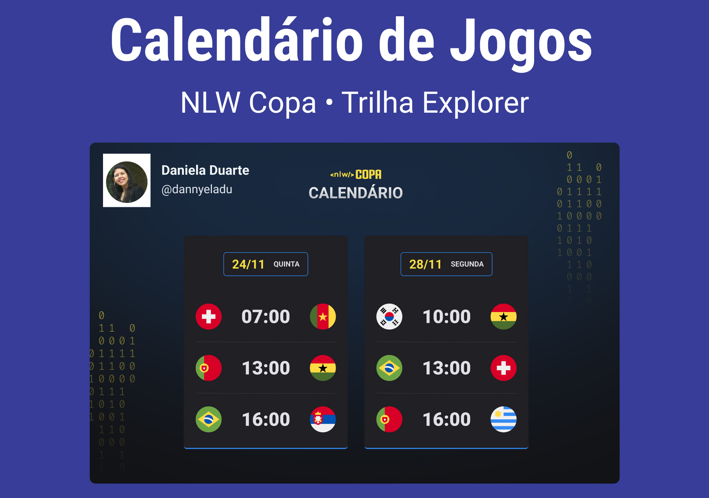

<h1 align="center"> NLW Copa </h1>

Evento exclusivo e gratuito, promovido pela Rocketseat para ensino de tecnologias WEB.

  <a href="#-tecnologias">Tecnologias</a>     |    
  <a href="#-projeto">Projeto</a>     |    
  <a href="#-layout">Layout</a>     |    
  <a href="#memo-licença">Licença</a>

  

 

  

## 🚀 Tecnologias

Esse projeto foi desenvolvido com as seguintes tecnologias:

- HTML e CSS
- JavaScript
  -Git e Github

## 💻 Projeto

O Calendario da Copa é um projeto que mostra os jogos da Copa 2022 no Qatar.

## 🔖 Disposição

Você pode visualizar o layout do projeto através de [ DESSE LINK ](<https://www.figma.com/file/FzSk0aC3zfySVv8u0Rj6bn/Calendário-de-Jogos-(Community)?node-id=172%3A179>). É necessário ter conta no [ Figma ](https://figma.com) para acessá-lo.

## : memorando : Licença

Esse projeto está sob a licença MIT.

---

Feito com ♥ por Rocketseat : wave : [ Participe da nossa comunidade! ](https://discord.gg/rocketseat)
